# PostgreSQL Provisioning for Dev, Test, and Prod

This documentation describes the internal GitHub Actions workflow for provisioning application databases across three PostgreSQL environments (dev, test, prod).  
The goal is a repeatable, secure, and idempotent setup of:
- an application user (login role),
- a dedicated database,
- basic privileges (CONNECT, TEMP, CREATE),
- and a consolidated summary of all provisioned resources.

During execution, the necessary firewall rule for the CI runner is temporarily opened and automatically removed afterward.

---

## Workflow Flow

```mermaid
flowchart TD
    Start([workflow_dispatch]) --> Inputs[/"app_name, dev_password,
    test_password, prod_password"/]

    Inputs --> Validate{Input validieren<br/>regex check}
    Validate -- ungültig --> Fail1[Abbruch]
    Validate -- gültig --> Matrix

    subgraph Matrix["Provision Matrix (dev → test → prod, sequentiell)"]
        direction TB
        Civo[Civo CLI installieren<br/>+ API Key setzen]
        Civo --> DetectIP[Runner Public IPv4<br/>ermitteln]
        DetectIP --> FWOpen[Firewall: Port 5432<br/>temporär öffnen]
        FWOpen --> Psql[psql Client<br/>installieren]
        Psql --> PreState[Pre-State prüfen<br/>Role/DB existiert?]
        PreState --> Upload1[Pre-State Artifact<br/>hochladen]
        Upload1 --> Provision

        subgraph Provision[Provisioning]
            direction TB
            P1[Passwörter maskieren]
            P1 --> P2{Role existiert?}
            P2 -- nein --> P3[CREATE ROLE mit Passwort]
            P2 -- ja --> P4[ALTER ROLE Passwort setzen]
            P3 --> P5{DB existiert?}
            P4 --> P5
            P5 -- nein --> P6[CREATE DATABASE]
            P5 -- ja --> P7[DB-Erstellung überspringen]
            P6 --> P8[GRANT Privilegien<br/>CONNECT, TEMP, CREATE]
            P7 --> P8
        end

        Provision --> Upload2[Summary Artifact<br/>hochladen]
        Upload2 --> FWClose[Firewall: temporäre<br/>Regel entfernen]
    end

    Matrix -- Erfolg --> Summary
    Matrix -- Fehlschlag --> Rollback

    subgraph Summary["Summary Job"]
        S1[Alle Summary Artifacts<br/>herunterladen] --> S2[Gesamtübersicht als<br/>GitHub Step Summary]
    end

    subgraph Rollback["Rollback Job (bei Fehlschlag)"]
        direction TB
        R0[Civo CLI + psql<br/>installieren]
        R0 --> R1[IPv4 ermitteln +<br/>Firewall öffnen]
        R1 --> R2[Pre-State Artifact<br/>herunterladen]
        R2 --> R3{Pre-State<br/>vorhanden?}
        R3 -- nein --> R4[Kein Rollback möglich]
        R3 -- ja --> R5{DB war neu<br/>erstellt?}
        R5 -- ja --> R6[Verbindungen trennen<br/>+ DROP DATABASE]
        R5 -- nein --> R7{Role war neu<br/>erstellt?}
        R6 --> R7
        R7 -- ja --> R8[DROP ROLE]
        R7 -- nein --> R9[Rollback Summary<br/>schreiben]
        R8 --> R9
        R4 --> R10[Firewall: temporäre<br/>Regel entfernen]
        R9 --> R10
    end

    Summary --> Done([Fertig])
    Rollback --> Done

    style Start fill:#2d6a4f,color:#fff
    style Done fill:#2d6a4f,color:#fff
    style Fail1 fill:#d00,color:#fff
    style Rollback fill:#fdf0d5,stroke:#c77800
    style Summary fill:#d5f5e3,stroke:#27ae60
    style Matrix fill:#e8f4fd,stroke:#2980b9
    style Provision fill:#dbeafe,stroke:#3b82f6
```

---

## Overview

- **Trigger:** Manual via GitHub Actions (`workflow_dispatch`)
- **Environments:** dev, test, prod (matrix strategy)
- **Naming conventions:**
  - User: `{app_name}_user`
  - Database: `{app_name}_db`
  - Schema: `public`
- **Security:**
  - SSL enforced (`sslmode=require`)
  - Password masking in logs
  - Temporary IP-bound firewall rule
- **Robustness:**
  - Automatic retries on DB operations

---

## Features

- Create or update the application login per environment  
- Create a dedicated UTF-8 database (if not already existing)  
- Grant `CONNECT`, `TEMP`, and `CREATE` privileges on the database to the application user  
- Temporarily open TCP/5432 for the runner’s IP in the target firewall  
- Merge per-environment results into a unified summary (Actions Summary)

---

## Prerequisites

- For each environment (dev, test, prod): a reachable PostgreSQL server with SSL support  
- Admin account with privileges to:
  - `CREATE ROLE` / `ALTER ROLE` (set/change passwords)
  - `CREATE DATABASE`
  - `GRANT` on databases
- Access to the corresponding network/firewall configuration  
- GitHub Actions enabled, with permissions to set secrets and variables  

---

## Configuration

**Secrets** (`Actions > Secrets and variables > Actions > Secrets`):
- `CIVO_API_KEY`: API token for cloud firewall access  
- `DEV_SERVER_ADMIN_PASSWORD`: Admin password for dev  
- `TEST_SERVER_ADMIN_PASSWORD`: Admin password for test  
- `PROD_SERVER_ADMIN_PASSWORD`: Admin password for prod  

**Variables** (`Actions > Secrets and variables > Actions > Variables`):
- `DEV_SERVER_HOST`: Host/IP of the PostgreSQL server (dev)  
- `TEST_SERVER_HOST`: Host/IP (test)  
- `PROD_SERVER_HOST`: Host/IP (prod)  
- `ADMIN_USER`: Admin username (e.g. postgres)  
- `DEV_FIREWALL_NAME`: Firewall identifier for dev  
- `TEST_FIREWALL_NAME`: Firewall identifier for test  
- `PROD_FIREWALL_NAME`: Firewall identifier for prod  

**Notes:**
- Default port is `5432`. If different, update both workflow config and firewall rule.  
- Secrets are used only at runtime and are masked in logs.  

---

## Usage (Step-by-Step)

### 1) Preparation
- Verify that all required secrets and variables are set and correct.  
- Ensure DB servers are reachable (including SSL).  
- Confirm firewall identifiers per environment.  

### 2) Start the workflow
- Go to **Actions**, open the **Provision Workflow**, and select **Run workflow**.  

### 3) Input parameters
- `app_name` (required): Base name of the application, e.g. `shop`  
  - Generates: user `shop_user`, database `shop_db`
- `dev_password` (required): Password for dev application user  
- `test_password` (required): Password for test application user  
- `prod_password` (required): Password for prod application user  

### 4) Execution flow
- The runner’s public IPv4 is determined.  
- Temporary firewall rule for TCP/5432 is created for this IP.  
- `psql` client is installed.  
- For each environment:
  - Create or update role `{app_name}_user` (password set idempotently).  
  - Create database `{app_name}_db` with UTF-8 (if not existing).  
  - `GRANT CONNECT, TEMP, CREATE` on DB to `{app_name}_user`.  
- Temporary firewall rule is removed.  
- Compact summary generated in GitHub Actions Summary.  

---

## Results and Evidence

- The GitHub Actions Summary includes a table listing:
  - Environment, Host:Port, User, Database, Schema (`public`)
- Each environment generates a short result file merged into the final summary.  
- Logs record all steps, with sensitive data masked.  

---

## Idempotency and Repeatability

- Role passwords are explicitly reset on every run (deliberately idempotent).  
- Database creation: if DB already exists, the step is skipped; grants still applied.  
- `GRANT` statements are repeatable and safe.  

**Recommendations:**
- For password rotation, simply rerun the workflow with new passwords.  
- Keep hosts/ports/firewall names consistently updated in variables.  

---

## Operations and Maintenance

- **Password rotation:**  
  - Rerun workflow with new passwords.  
- **Port changes:**  
  - Update port in both workflow configuration and firewall rule.  
- **Adding new environments (e.g. staging):**  
  - Add another matrix definition (host, admin secret, firewall name, env_name).  
  - Add corresponding secrets and variables.  
- **Regular maintenance:**  
  - Renew API keys and admin credentials periodically.  
  - Monitor DB versions, SSL requirements, and company policies.  

---

## Security Considerations

- SSL enforced (`sslmode=require`).  
- Passwords masked immediately after being read (including trimmed variants).  
- Firewall rules restricted to runner IP (/32) and reliably removed (even on error).  
- Admin credentials only provided via secrets—never in plain text variables or files.  

---

## Troubleshooting

**Connection fails:**
- Check host, port, and admin user variables.  
- Verify connectivity (DNS, routing, security groups/firewall).  
- Ensure SSL requirements; the server must accept encrypted connections.  

**Firewall issues:**
- Correct firewall name set per environment?  
- Was the temporary rule created (check logs)?  
- Region of the firewall matches the target environment?  

**Permission errors:**
- Does the admin have `CREATE ROLE`, `ALTER ROLE`, `CREATE DATABASE`, `GRANT` privileges?  
- If `CREATE DATABASE` is restricted: pre-create DB manually, let workflow assign privileges.  

**Instability/Timeouts:**
- Built-in retry mechanism (multiple attempts with delay).  
- Check network stability, latency, and load.  

**Empty summary:**
- Confirm that result files were created and summary step executed successfully.  

---

## FAQ

**What privileges does the application user receive?**  
`CONNECT`, `TEMP`, and `CREATE` on its dedicated database (further object-level privileges managed separately).

**Which encoding is used?**  
UTF-8. Adjustments are possible but should be centrally coordinated.  

**What happens if an environment is unreachable?**  
After several retries, that environment’s job fails. Restart after stability is restored.  

---

## Governance and Change Management

- Document all secret/variable changes (Who/What/When/Why).  
- Review workflow modifications before merging.  
- For major changes (e.g. privilege model, additional schemas), align with DB and security teams.  

---

## Glossary

- **Application user:** Login role through which the app connects to the DB.  
- **Dedicated database:** One database per app and environment for isolation.  
- **Matrix job:** Executes the workflow for multiple defined environments.  
- **Summary:** Automatically generated result overview in the GitHub Actions run.
